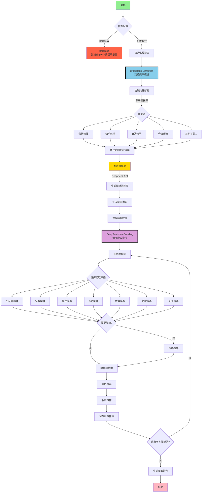

> [!warning]
> 好像最近項目中用來請求每日熱點新聞的api接口被ban了，可以自己部署一下[newsnow](https://github.com/ourongxing/newsnow)，很快的可以一鍵部署，然後替換掉這個URL即可，最近一個月我也會commit一版更通用的解決方案。
> ```python
> #新聞API基礎URL
> BASE URL = "https://newsnow.busiyi.world"
> ```

# MindSpider - 專爲輿情分析設計的AI爬蟲

> 免責聲明：
> 本倉庫的所有內容僅供學習和參考之用，禁止用於商業用途。任何人或組織不得將本倉庫的內容用於非法用途或侵犯他人合法權益。本倉庫所涉及的爬蟲技術僅用於學習和研究，不得用於對其他平臺進行大規模爬蟲或其他非法行爲。對於因使用本倉庫內容而引起的任何法律責任，本倉庫不承擔任何責任。使用本倉庫的內容即表示您同意本免責聲明的所有條款和條件。

## 項目概述

MindSpider是一個基於Agent技術的智能輿情爬蟲系統，通過AI自動識別熱點話題，並在多個社交媒體平臺進行精準的內容爬取。系統採用模塊化設計，能夠實現從話題發現到內容收集的全自動化流程。

該部分學習借鑑github知名爬蟲項目[MediaCrawler](https://github.com/NanmiCoder/MediaCrawler)

兩步走爬取：

- 模塊一：Search Agent從包括微博、知乎、github、酷安等 **13個** 社媒平臺、技術論壇識別熱點新聞，並維護一個每日話題分析表。
- 模塊二：全平臺爬蟲深度爬取每個話題的細粒度輿情反饋。

<div align="center">


MindSpider 運行示例
</div>

### 技術架構

- **編程語言**: Python 3.9+
- **AI框架**: 默認Deepseek，可以接入多種api (話題提取與分析)
- **爬蟲框架**: Playwright (瀏覽器自動化)
- **數據庫**: MySQL (數據持久化存儲)
- **併發處理**: AsyncIO (異步併發爬取)

## 項目結構

```
MindSpider/
├── BroadTopicExtraction/           # 話題提取模塊
│   ├── database_manager.py         # 數據庫管理器
│   ├── get_today_news.py          # 新聞採集器
│   ├── main.py                    # 模塊主入口
│   └── topic_extractor.py         # AI話題提取器
│
├── DeepSentimentCrawling/         # 深度爬取模塊
│   ├── keyword_manager.py         # 關鍵詞管理器
│   ├── main.py                   # 模塊主入口
│   ├── platform_crawler.py       # 平臺爬蟲管理器
│   └── MediaCrawler/             # 多平臺爬蟲核心
│       ├── base/                 # 基礎類
│       ├── cache/                # 緩存系統
│       ├── config/               # 配置文件
│       ├── media_platform/       # 各平臺實現
│       │   ├── bilibili/        # B站爬蟲
│       │   ├── douyin/          # 抖音爬蟲
│       │   ├── kuaishou/        # 快手爬蟲
│       │   ├── tieba/           # 貼吧爬蟲
│       │   ├── weibo/           # 微博爬蟲
│       │   ├── xhs/             # 小紅書爬蟲
│       │   └── zhihu/           # 知乎爬蟲
│       ├── model/               # 數據模型
│       ├── proxy/               # 代理管理
│       ├── store/               # 存儲層
│       └── tools/               # 工具集
│
├── schema/                       # 數據庫架構
│   ├── db_manager.py            # 數據庫管理
│   ├── init_database.py         # 初始化腳本
│   └── mindspider_tables.sql    # 表結構定義
│
├── config.py                    # 全局配置文件
├── main.py                      # 系統主入口
├── requirements.txt             # 依賴列表
└── README.md                    # 項目文檔
```

## 系統工作流程

### 整體架構流程圖



### 工作流程說明

#### 1. BroadTopicExtraction（話題提取模塊）

該模塊負責每日熱點話題的自動發現和提取：

1. **新聞採集**：從多個主流平臺（微博、知乎、B站等）自動採集熱點新聞
2. **AI分析**：使用DeepSeek API對新聞進行智能分析
3. **話題提取**：自動識別熱點話題並生成相關關鍵詞
4. **數據存儲**：將話題和關鍵詞保存到MySQL數據庫

#### 2. DeepSentimentCrawling（深度爬取模塊）

基於提取的話題關鍵詞，在各大社交平臺進行深度內容爬取：

1. **關鍵詞加載**：從數據庫讀取當日提取的關鍵詞
2. **平臺爬取**：使用Playwright在7大平臺進行自動化爬取
3. **內容解析**：提取帖子、評論、互動數據等
4. **情感分析**：對爬取內容進行情感傾向分析
5. **數據持久化**：將所有數據結構化存儲到數據庫

## 數據庫架構

### 核心數據表

1. **daily_news** - 每日新聞表
   - 存儲從各平臺採集的熱點新聞
   - 包含標題、鏈接、描述、排名等信息

2. **daily_topics** - 每日話題表
   - 存儲AI提取的話題和關鍵詞
   - 包含話題名稱、描述、關鍵詞列表等

3. **topic_news_relation** - 話題新聞關聯表
   - 記錄話題與新聞的關聯關係
   - 包含關聯度得分

4. **crawling_tasks** - 爬取任務表
   - 管理各平臺的爬取任務
   - 記錄任務狀態、進度、結果等

5. **平臺內容表**（繼承自MediaCrawler）
   - xhs_note - 小紅書筆記
   - douyin_aweme - 抖音視頻
   - kuaishou_video - 快手視頻
   - bilibili_video - B站視頻
   - weibo_note - 微博帖子
   - tieba_note - 貼吧帖子
   - zhihu_content - 知乎內容

## 安裝部署

### 環境要求

- Python 3.9 或更高版本
- MySQL 5.7 或更高版本
- Conda環境：pytorch_python11（推薦）
- 操作系統：Windows/Linux/macOS

### 1. 克隆項目

```bash
git clone https://github.com/yourusername/MindSpider.git
cd MindSpider
```

### 2. 創建並激活環境

#### Conda配置方法

#### Conda配置方法

```bash
# 創建名爲 pytorch_python11 的conda環境並指定Python版本
conda create -n pytorch_python11 python=3.11
# 激活該環境
conda activate pytorch_python11
```

#### UV配置方法

> [UV 是一種快速輕量級 Python 包環境管理工具，適用於低依賴及便捷管理需求。可參考：https://github.com/astral-sh/uv]

- 安裝uv（如未安裝）
```bash
pip install uv
```
- 創建虛擬環境並激活
```bash
uv venv --python 3.11 # 創建3.11環境
source .venv/bin/activate   # Linux/macOS
# 或
.venv\Scripts\activate      # Windows
```


### 3. 安裝依賴

```bash
# 安裝Python依賴
pip install -r requirements.txt

或
# uv版本更加快速
uv pip install -r requirements.txt


# 安裝Playwright瀏覽器驅動
playwright install
```

### 4. 配置系統

複製.env.example文件爲.env文件，放置在項目根目錄。編輯 `.env` 文件，設置數據庫和API配置：

```python
# MySQL數據庫配置
DB_HOST = "your_database_host"
DB_PORT = 3306
DB_USER = "your_username"
DB_PASSWORD = "your_password"
DB_NAME = "mindspider"
DB_CHARSET = "utf8mb4"

# DeepSeek API密鑰
MINDSPIDER_BASE_URL=your_api_base_url
MINDSPIDER_API_KEY=sk-your-key
MINDSPIDER_MODEL_NAME=deepseek-chat
```

### 5. 初始化系統

```bash
# 檢查系統狀態
python main.py --status

# 初始化數據庫表
python main.py --setup
```

## 使用指南

### 完整流程

```bash
# 1. 運行話題提取（獲取熱點新聞和關鍵詞）
python main.py --broad-topic

# 2. 運行爬蟲（基於關鍵詞爬取各平臺內容）
python main.py --deep-sentiment --test

# 或者一次性運行完整流程
python main.py --complete --test
```

### 單獨使用模塊

```bash
# 只獲取今日熱點和關鍵詞
python main.py --broad-topic

# 只爬取特定平臺
python main.py --deep-sentiment --platforms xhs dy --test

# 指定日期
python main.py --broad-topic --date 2024-01-15
```

## 爬蟲配置（重要）

### 平臺登錄配置

**首次使用每個平臺都需要登錄，這是最關鍵的步驟：**

1. **小紅書登錄**
```bash
# 測試小紅書爬取（會彈出二維碼）
python main.py --deep-sentiment --platforms xhs --test
# 用小紅書APP掃碼登錄，登錄成功後會自動保存狀態
```

2. **抖音登錄**
```bash
# 測試抖音爬取
python main.py --deep-sentiment --platforms dy --test
# 用抖音APP掃碼登錄
```

3. **其他平臺同理**
```bash
# 快手
python main.py --deep-sentiment --platforms ks --test

# B站
python main.py --deep-sentiment --platforms bili --test

# 微博
python main.py --deep-sentiment --platforms wb --test

# 貼吧
python main.py --deep-sentiment --platforms tieba --test

# 知乎
python main.py --deep-sentiment --platforms zhihu --test
```

### 登錄問題排除

**如果登錄失敗或卡住：**

1. **檢查網絡**：確保能正常訪問對應平臺
2. **關閉無頭模式**：編輯 `DeepSentimentCrawling/MediaCrawler/config/base_config.py`
   ```python
   HEADLESS = False  # 改爲False，可以看到瀏覽器界面
   ```
3. **手動處理驗證**：有些平臺可能需要手動滑動驗證碼
4. **重新登錄**：刪除 `DeepSentimentCrawling/MediaCrawler/browser_data/` 目錄重新登錄

### 爬取參數調整

在實際使用前建議調整爬取參數：

```bash
# 小規模測試（推薦先這樣測試）
python main.py --complete --test

# 調整爬取數量
python main.py --complete --max-keywords 20 --max-notes 30
```

### 高級功能

#### 1. 指定日期操作
```bash
# 提取指定日期的話題
python main.py --broad-topic --date 2024-01-15

# 爬取指定日期的內容
python main.py --deep-sentiment --date 2024-01-15
```

#### 2. 指定平臺爬取
```bash
# 只爬取小紅書和抖音
python main.py --deep-sentiment --platforms xhs dy --test

# 爬取所有平臺的特定數量內容
python main.py --deep-sentiment --max-keywords 30 --max-notes 20
```

## 常用參數

```bash
--status              # 檢查項目狀態
--setup               # 初始化項目
--broad-topic         # 話題提取
--deep-sentiment      # 爬蟲模塊
--complete            # 完整流程
--test                # 測試模式（少量數據）
--platforms xhs dy    # 指定平臺
--date 2024-01-15     # 指定日期
```

## 支持的平臺

| 代碼 | 平臺 | 代碼 | 平臺 |
|-----|-----|-----|-----|
| xhs | 小紅書 | wb | 微博 |
| dy | 抖音 | tieba | 貼吧 |
| ks | 快手 | zhihu | 知乎 |
| bili | B站 | | |

## 常見問題

### 1. 爬蟲登錄失敗
```bash
# 問題：二維碼不顯示或登錄失敗
# 解決：關閉無頭模式，手動登錄
# 編輯：DeepSentimentCrawling/MediaCrawler/config/base_config.py
HEADLESS = False

# 重新運行登錄
python main.py --deep-sentiment --platforms xhs --test
```

### 2. 數據庫連接失敗
```bash
# 檢查配置
python main.py --status

# 檢查config.py中的數據庫配置是否正確
```

### 3. playwright安裝失敗
```bash
# 重新安裝
pip install playwright

或

uv pip install playwright

playwright install
```

### 4. 爬取數據爲空
- 確保平臺已經登錄成功
- 檢查關鍵詞是否存在（先運行話題提取）
- 使用測試模式驗證：`--test`

### 5. API調用失敗
- 檢查DeepSeek API密鑰是否正確
- 確認API額度是否充足

## 注意事項

1. **首次使用必須先登錄各平臺**
2. **建議先用測試模式驗證**
3. **遵守平臺使用規則**
4. **僅供學習研究使用**

## 項目開發指南

### 擴展新的新聞源

在 `BroadTopicExtraction/get_today_news.py` 中添加新的新聞源：

```python
async def get_new_platform_news(self) -> List[Dict]:
    """獲取新平臺的熱點新聞"""
    # 實現新聞採集邏輯
    pass
```

### 擴展新的爬蟲平臺

1. 在 `DeepSentimentCrawling/MediaCrawler/media_platform/` 下創建新平臺目錄
2. 實現平臺的核心功能模塊：
   - `client.py`: API客戶端
   - `core.py`: 爬蟲核心邏輯
   - `login.py`: 登錄邏輯
   - `field.py`: 數據字段定義

### 數據庫擴展

如需添加新的數據表或字段，請更新 `schema/mindspider_tables.sql` 並運行：

```bash
python schema/init_database.py
```

## 性能優化建議

1. **數據庫優化**
   - 定期清理歷史數據
   - 爲高頻查詢字段建立索引
   - 考慮使用分區表管理大量數據

2. **爬取優化**
   - 合理設置爬取間隔避免被限制
   - 使用代理池提高穩定性
   - 控制併發數避免資源耗盡

3. **系統優化**
   - 使用Redis緩存熱點數據
   - 異步任務隊列處理耗時操作
   - 定期監控系統資源使用

## API接口說明

系統提供Python API供二次開發：

```python
from BroadTopicExtraction import BroadTopicExtraction
from DeepSentimentCrawling import DeepSentimentCrawling

# 話題提取
async def extract_topics():
    extractor = BroadTopicExtraction()
    result = await extractor.run_daily_extraction()
    return result

# 內容爬取
def crawl_content():
    crawler = DeepSentimentCrawling()
    result = crawler.run_daily_crawling(
        platforms=['xhs', 'dy'],
        max_keywords=50,
        max_notes=30
    )
    return result
```

## 許可證

本項目僅供學習研究使用，請勿用於商業用途。使用本項目時請遵守相關法律法規和平臺服務條款。

---

**MindSpider** - 讓AI助力輿情洞察，智能化內容分析的得力助手
